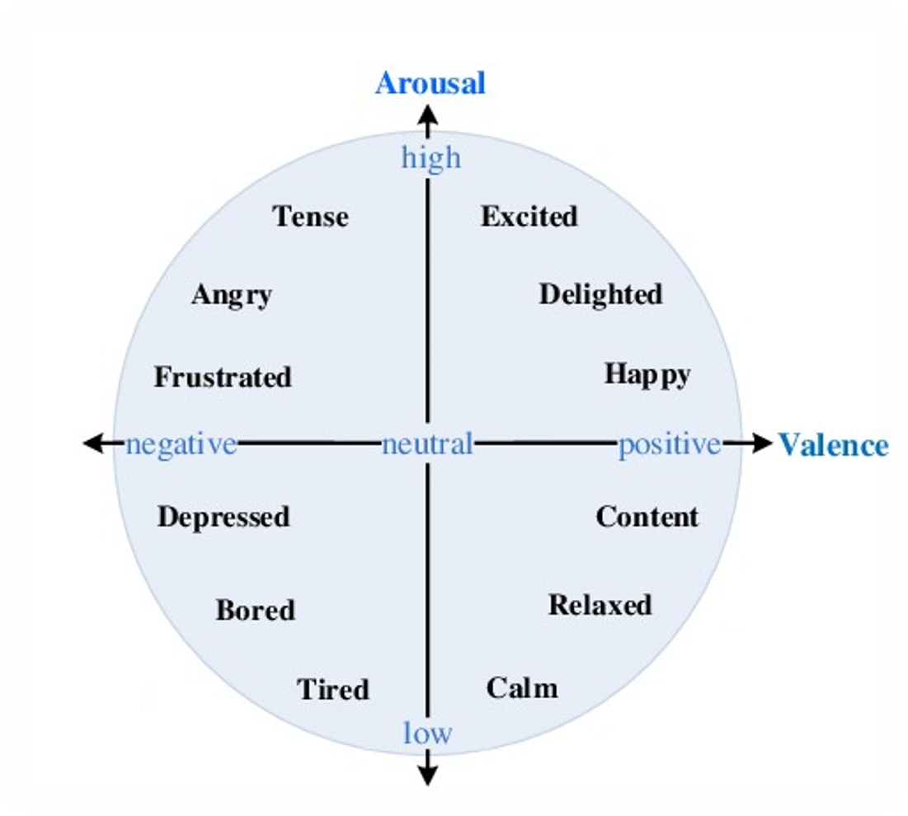
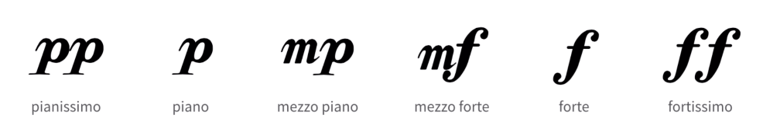

# Hand Emotion Recognition - Custom Data

For New Capture Video from your own resource please follow the following steps!
## Step 1 : data preparation

### Video
Place the video you capture in [./ryks/raw_videos](./ryks/raw_videos/) folder

__PLEASE MAKE SURE TO RENAME THE VIDEO TO SONG NAME__
### Emotion label
Place emotion label (.json file) in [./ryks/emotion_labels](./ryks/emotion_labels/) folder

the emotion label can be define as two value
1. Valence
2. Arousal
Value range: 1~9

These can be map on the following Corordinates:
<p align="center"></p>
(5,5)->Neutral Emotion

emotion will easy classify into four dimention 
- dimension 1 => label 0
- dimension 2 => label 1
- dimension 3 => label 2
- dimension 4 => label 3

### Third Emotion label (Strength)
Stength is the symbol which is written on sheet music. It represent the Strong or the weak of the Music itself (voice)

Since the project goal is to recognize the emotion by "vision",so this label hasn't used in this project.
<p align="center"></p>


## Step 2 : Trim the Video by the Emotion label
The code will read the timestamp in Emotion label & trim the video into clips.

__One clip represent One emotion__

__MAKE SURE THE LABEL FILE NAME IS EXACT THE SAME AS VIDEO FILE NAME__
```bash
cd ryks
python trim_vids.py
```
the result will output in "/ryks/clips"
### Explaination of Naming
<h5>{Song_Name}_clip_{clip num}_emotion_{valence}_{arousal}_ {strength}_{label}<h5>
ex.
1Arlequin_clip_0_emotion_7_7_2_label_0


## Step 3 : trun video into frames
Since the model needs to read the video by frames (photo). 
- from .mp4 to .jpg
```bash
cd ryks
python extract_frames.py
```
the result will output in "/ryks/frames"

## Step 4 (Optional): Preprocess the frames 

- To denoise the data. Make the model focus on Hands
```bash
cd ryks
python denoise_mask.py
```

- Denoise & Crop
```bash
cd ryks
python denoise_mask_crop.py
```

# Step 5 : Generate data for Training (.pkl)
Back to [data](./) folder

For EgoGesture data ( RGB + Depth )
```bash
# back to data folder
python gen_ego_pkl.py
```
For jester data ( RGB only )
```bash
# back to data folder
python gen_jester_pkl.py
```

- p.s. this code will get the frames in [./ryks/frames/](./ryks/frames/), __make sure the data in folder is what you want__.

It will generate the .pkl file for training
and .csv file for viewing the output result.
For Two types of output : 
- jester pkl path :[".\ryks\jester_pkl_csv"](.\ryks\jester_pkl_csv)
- EgoGesture pkl path :[ ".\ryks\Ego_pkl_csv"](.\ryks\Ego_pkl_csv)

## Step 6 : Ready for Training 
For EgoGesture data
- Move all of the file in ".\ryks\Ego_pkl_csv" to ["EgoGesture_annotation"](EgoGesture_annotation)

For jester data
- Move all of the file in ".\ryks\jester_pkl_csv" to ["jester_annotation"](jester_annotation)

## Step 7 : Back to root folder Start Training

[root folder](../README.md/) ==>Train

