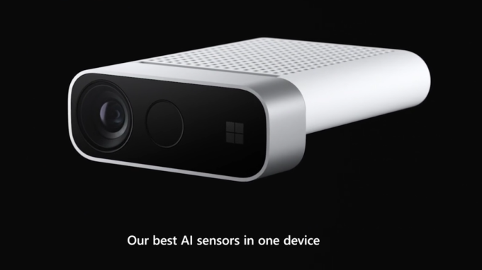

# KinectCapture_mediapipe
## Equipment 
Azure Kinect
<p align="center"></p>
It can capture RGB video & Depth Video at the same time 

## Install driver for Kinect
execute the
 - "Azure Kinect Body Tracking SDK 1.1.2.msi" 
 - "Azure Kinect SDK 1.4.1.exe"

## Install the Package for Mediapipe
```bash
pip install ipykernel opencv-python matplotlib
pip install mediapipe
# this project has already included the Kinect Library in pykinect_azure folder
```


## Usage
Open [VidsCap.ipynb](VidsCap.ipynb)
and follows the instruction in notebook file
